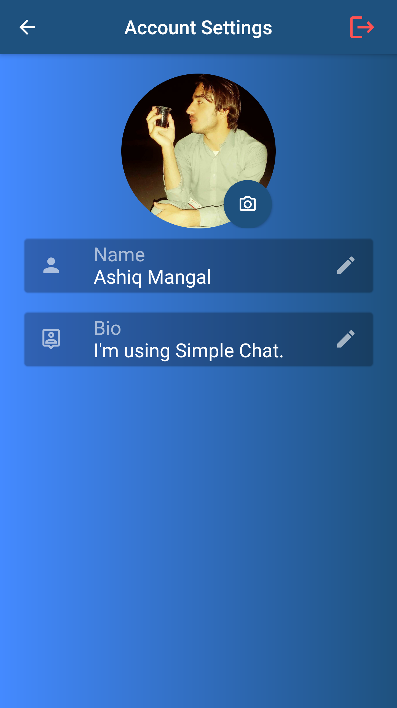

# simplechat
This app isn't the final or stable version. I have to do many things before claiming it a stable version. The code is simple and lengthy, I will refactor every class and function for the optimization of the application. There are some other funtions which should be done in a comming future. Some of them are, Saving the history of the chat in the home page, deleting messages history, deleting a specific message, blocking a user, adding request and so many. 

## Getting Started
## Screenshot

This project is a starting point for a Flutter application.

A few resources to get you started if this is your first Flutter project:

- [Lab: Write your first Flutter app](https://flutter.dev/docs/get-started/codelab)
- [Cookbook: Useful Flutter samples](https://flutter.dev/docs/cookbook)

For help getting started with Flutter, view our
[online documentation](https://flutter.dev/docs), which offers tutorials,
samples, guidance on mobile development, and a full API reference.
